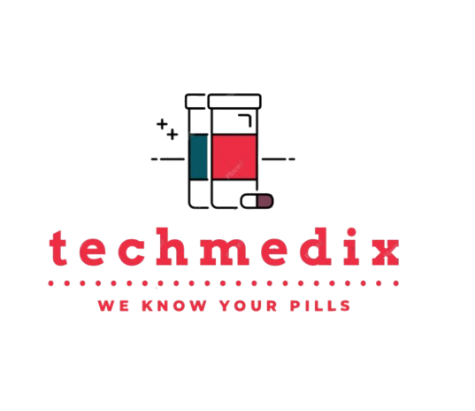

<div align="left" style="position: relative;">


<h1>TECHMEDIX</h1>

<p align="left">
<em>
TechMedix started as a medicine and health support platform, but it has now grown into a broader digital healthcare system. The project currently includes:

- a React web app for patients, doctors, and admins
- a React Native + Expo mobile app
- an Express + PostgreSQL backend
- realtime queue and notification handling with Socket.IO
- AI-assisted flows for health insights, prescriptions, and X-ray analysis

This platform is designed to make healthcare interactions feel more connected, more transparent, and easier to manage from one place.
</em>
</p>

<p align="left">


</p>
</div>

<br clear="right">

---

# 🌐 Live Demo

🔗 https://techmedix.onrender.com  

# 🌐 Mobile App

🔗 <a href="https://drive.google.com/drive/folders/1JhcFP6bhn77YDgEFq2S0mt93eqfVlzV0?usp=sharing">Mobile App</a>

### Demo Patient

```bash
Email: demo@gmail.com
Password: 123456789
```

### Demo Doctor

```bash
Email: singh@gmail.com
Password: 123456789
```

---


Patient-side flows include:

- dashboard and profile
- appointment booking
- queue status
- health wallet
- timeline and notifications
- medicine search
- prescription analysis
- X-ray analysis and history
- recordings and QR views

Doctor-side flows include:

- dashboard
- queue manager
- appointments
- schedule management
- patient lookup
- manual prescription support
- recording upload

Mobile app folder:

- https://drive.google.com/drive/folders/1JhcFP6bhn77YDgEFq2S0mt93eqfVlzV0?usp=sharing

## Main Features

### Patient Experience

- appointment booking with doctor availability
- payment support and wallet-related flows
- prescription upload and prescription result views
- medicine reminders and notifications
- health metrics and personal history tracking
- QR-based patient record access
- AI health chat and health insight support

### Doctor Experience

- doctor authentication and profile flows
- dashboard for appointments and queue visibility
- patient lookup by code
- schedule management
- consultation workflow support
- analytics and operational views

### Clinical Intelligence

- prescription intelligence and safety checks
- medicine search with price and comparison support
- AI-assisted health insight generation
- X-ray analysis through a dedicated Python service
- report and timeline generation

### Platform Infrastructure

- JWT and cookie-based authentication
- PostgreSQL-backed persistence
- startup migrations and schema initialization
- Socket.IO for queue and notification updates
- cron-based reminders and background jobs
- optional integrations with Cloudinary, Razorpay, Google Fit, and LLM providers


# 🛠 Tech Stack

## 🔹 Frontend
- React.js (Vite)
- Context API
- CSS3
- Responsive UI Design
- Socket.IO client
- 
## 🔹 Mobile
- React Native
- Expo 52
- React Navigation

## 🔹 Backend
- Node.js
- Express.js
- PostgreSQL (Neon)
- JWT Authentication
- Role-Based Access Control
- Socket.IO
- Cloudinary
- Razorpay

## 🔹 AI & Intelligence
- AI-based medicine recommendation engine
- Smart health insights generation

## 🔹 Deployment
- Render (Backend + Frontend)
- GitHub

---


# 📁 Project Structure

```sh
TechMedix/
├── backend/
│   ├── controllers/
│   ├── routes/
│   ├── models/
│   ├── middleware/
│   ├── config/
│   └── server.js
├── frontend/
│   ├── src/
│   ├── public/
│   └── package.json
├── mobile/
├── ai-service/
├── package.json
└── README.md
```

---

# 🔐 Environment Variables

Create a `.env` file inside `backend/`

```env
PORT=8080
DATABASE_URL=your_postgres_or_neon_connection_string
TOKEN_SECRET=your_jwt_secret
FRONTEND_URL=http://localhost:5173

API_KEY=your_llm_api_key
BASE_URL=your_llm_base_url
GEMINI_API_KEY=your_gemini_key
AI_SERVICE_URL=http://localhost:5005
AI_XRAY_SERVICE_URL=http://localhost:8000
ML_SERVICE_URL=http://localhost:5005

GOOGLE_CLIENT_ID=your_google_oauth_client_id
GOOGLE_FIT_CLIENT_ID=your_google_fit_client_id
GOOGLE_FIT_CLIENT_SECRET=your_google_fit_client_secret

CLOUDINARY_CLOUD_NAME=your_cloud_name
CLOUDINARY_API_KEY=your_cloudinary_key
CLOUDINARY_API_SECRET=your_cloudinary_secret
CLOUDINARY_FOLDER=techmedix
CLOUDINARY_HEALTH_WALLET_FOLDER=techmedix-health-wallet

RAZORPAY_KEY_ID=your_razorpay_key_id
RAZORPAY_KEY_SECRET=your_razorpay_key_secret

BACKEND_URL=http://localhost:8080
NODE_ENV=development
```


Create `frontend/.env`:

```env
VITE_API_URL=http://localhost:8080
```

Create `mobile/.env`:

```env
EXPO_PUBLIC_API_URL=http://YOUR_LOCAL_IP:8080
```

---

# 📡 API Endpoints

## 🔑 Auth
```
POST /api/auth/register
POST /api/auth/login
```

## 💊 Medicines
```
GET /api/medicines
POST /api/medicines
```

## 👩‍⚕️ Doctors
```
GET /api/doctors
```

## 📈 Reports
```
GET /api/reports
```

---

# 🚀 Getting Started

## ☑️ Prerequisites

- Node.js (v18+ recommended)
- npm

---

## ⚙️ Installation

```bash
git clone https://github.com/Aditya07024/TechMedix
cd TechMedix
```

---

## 🔹 Install Backend

```bash
cd backend
npm install
npm start
```

---

## 🔹 Install Frontend

```bash
cd frontend
npm install
npm run dev
```

---

## 🔹 Install Mobile

```bash
cd mobile
npm run start
```

# 🧪 Testing

```bash
npm test
```

---

# 🏗 Architecture Overview

```
Client (React)
      ↓
Express API (Node.js)
      ↓
PostgreSQL (Neon)
      ↓
AI Recommendation Engine
```

---

## Optional Python Services

### Health insights service

```bash
cd backend
python -m venv venv
venv\Scripts\activate
pip install -r requirements.txt
python ml_model_api.py
```

### X-ray AI service

```bash
cd ai-service
python -m venv venv
venv\Scripts\activate
pip install -r requirements.txt
python app.py
```


# 📌 Project Roadmap

- [x] Core MERN stack implementation
- [x] Third-party medicine APIs integration
- [x] AI-based recommendation system
- [x] Mobile app (React Native / Expo)
- [ ] Multilingual support
- [ ] Teleconsultation integration

---

# 🔰 Contributing

1. Fork the repository  
2. Create a feature branch  
3. Commit changes  
4. Push and create PR  

---

# 🙌 Acknowledgments

This project was built to promote transparency, affordability, and intelligence in healthcare decision-making.

---

# 📜 License

This project is licensed under the MIT License.
